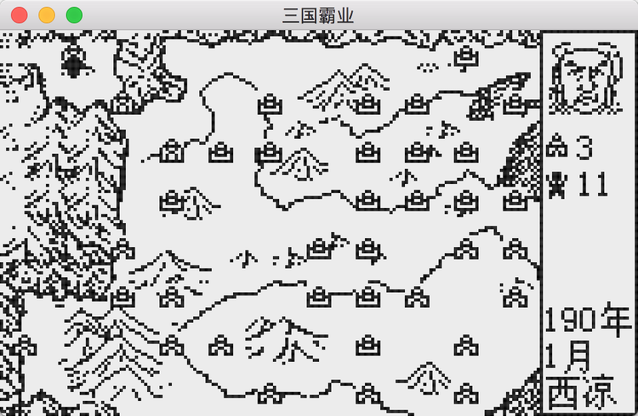
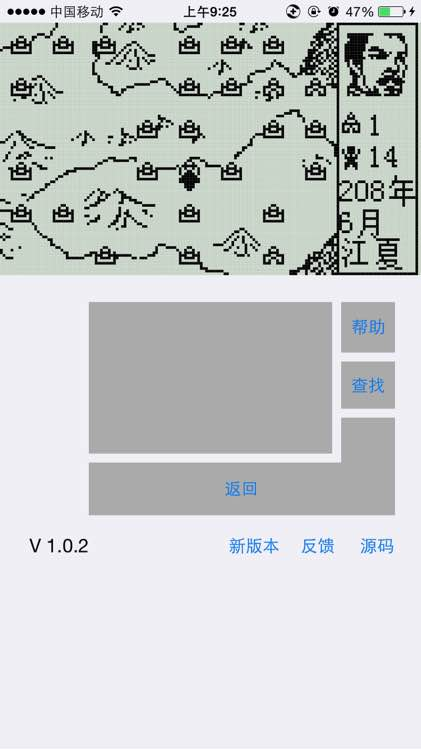
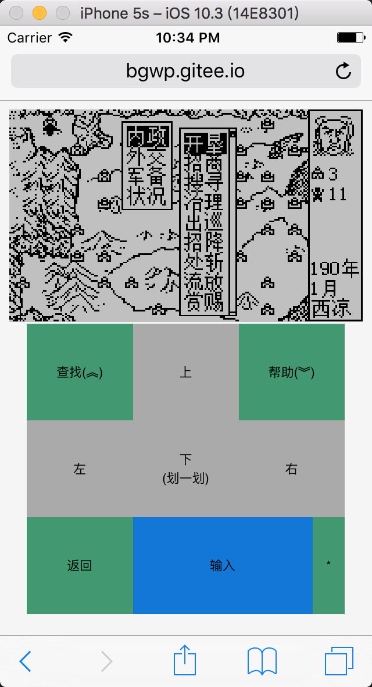
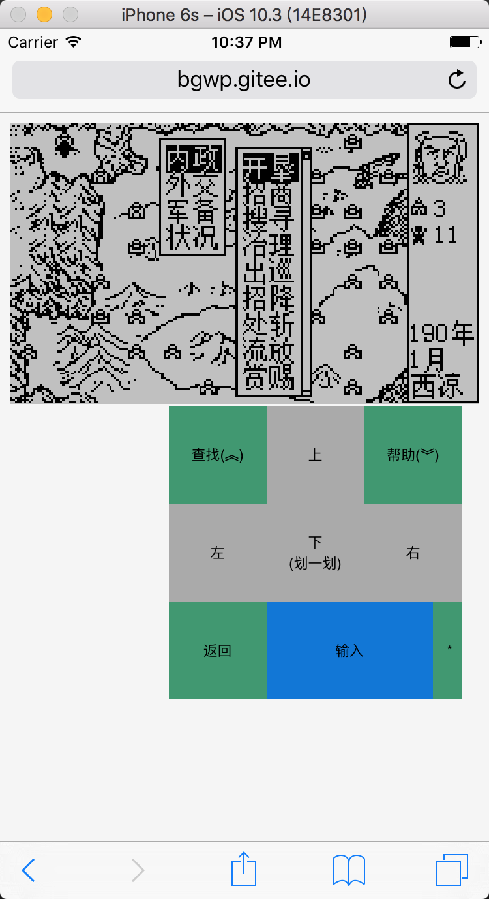
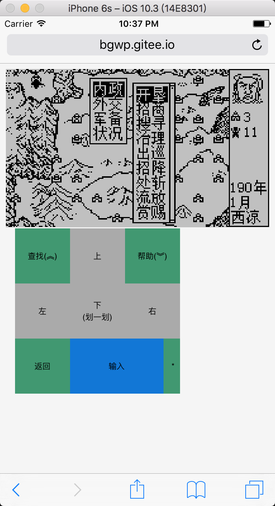
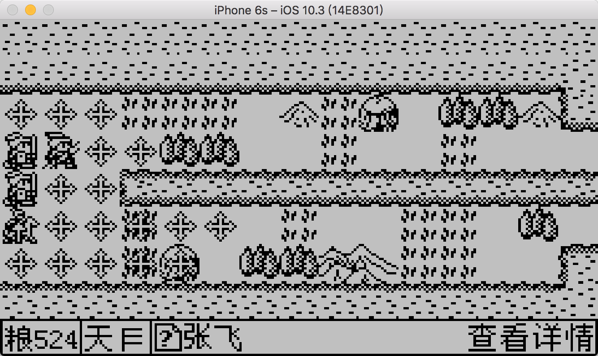
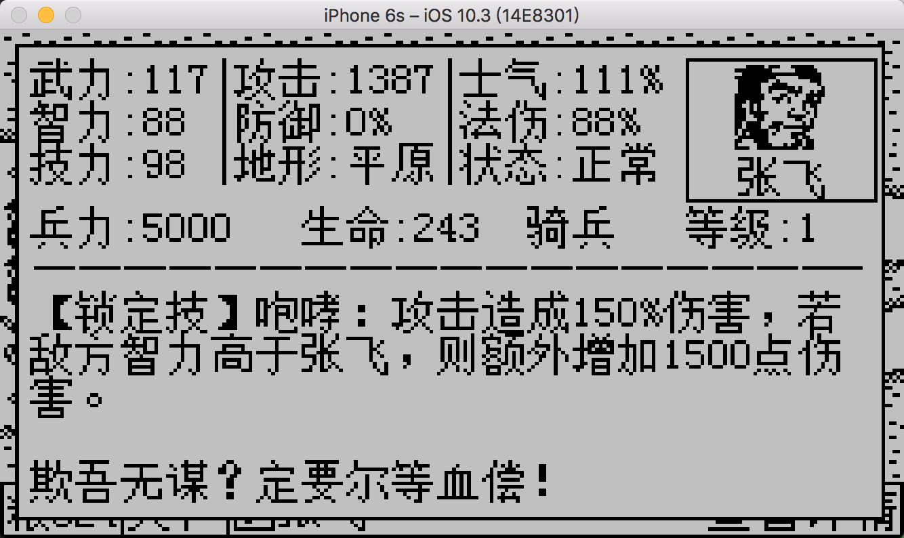

# iBaye - 步步高三国霸业 iOS & HTML5 移植版

交流QQ群：526266208

贴吧讨论与反馈:[http://tieba.baidu.com/p/3977138152](http://tieba.baidu.com/p/3977138152)

## 开发环境配置

1. 安装emscripten

    Ubuntu

	```
    sudo apt install emscripten
	```

	或参考[官方文档](http://kripken.github.io/emscripten-site/docs/getting_started/downloads.html#platform-notes-installation-instructions-portable-sdk),
	或直接下载配置好开发环境的虚拟机：[百度云下载](https://pan.baidu.com/s/1eRFehjW)


2. 下载霸业源码，编译生成baye.js

```
    git clone https://git.oschina.net/bgwp/iBaye.git
    cd iBaye/js
    emconfigure cmake ../src
    make
```

## 游戏截图

### macOS版


---

### iOS原生版


---

### HTML5 - PC端


---

### HTML5 - Mobile端




单手键盘：



---
### 支持高度定制mod，有丰富的修改mod

即使是农民，也能高度自由定制修改版本。



